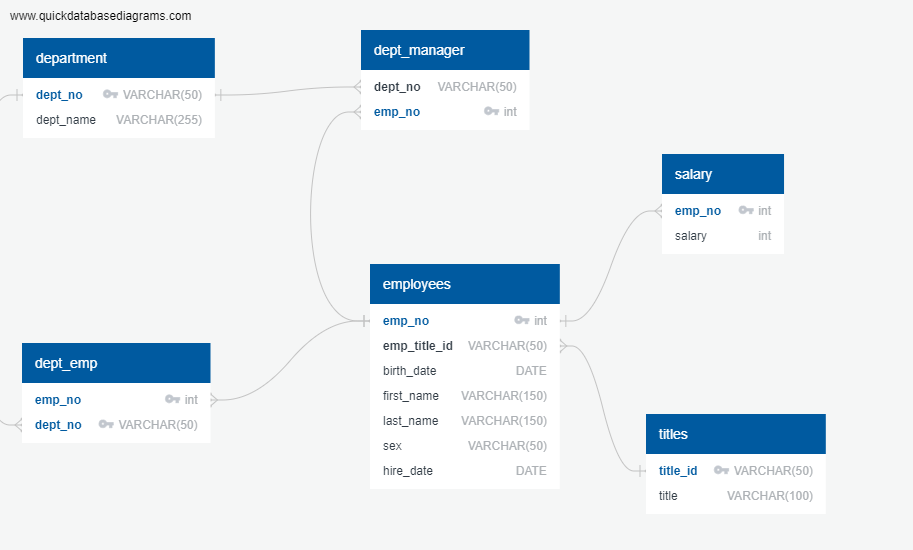
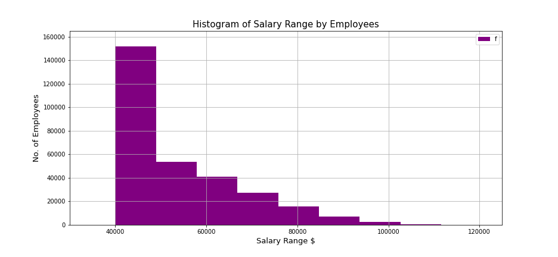
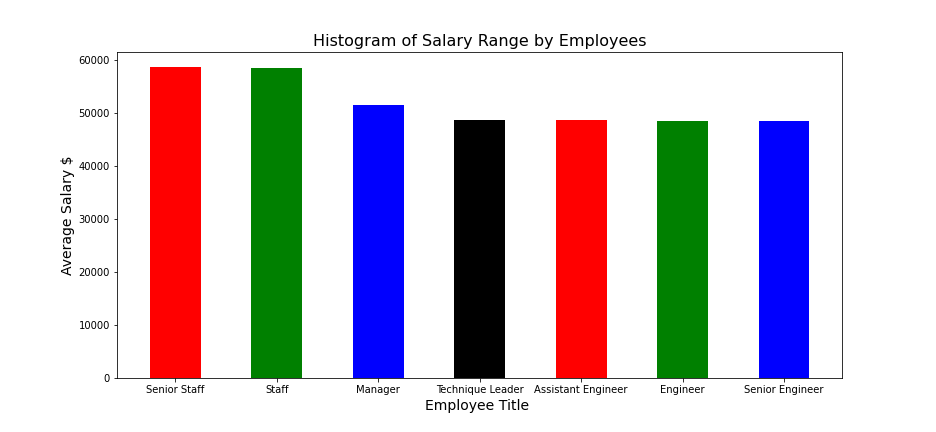
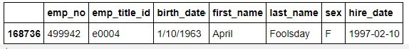

# sql-challenge
SQL Data Modeling, Sketch ERD, Create Schema and Data Analysis


## Table of contents
* [Introduction ](#introduction )
* [Objectives ](#objectives)
* [Observations and Insights ](#observations-and-insights)
* [Technologies](#technologies)
* [Code](#code)
* [Status](#status)
* [Acknowledgement ](#acknowledgement )
* [Contact](#contact)


## Introduction
__Pymaceuticals__  : As a new data engineer at Pewlett Hackard, my first major task is a research project on employees of the corporation from the 1980s and 1990s. All that remain of the database of employees from that period are six CSV files.I will design the tables to hold data in the CSVs, import the CSVs into a SQL database, and answer questions about the data. In other words, you will perform:

- Data Engineering
- Data Analysis.

### Objectives
 - Create a new repository __'EmployeeSQL'__ in GitHub and load Engineering and Analysis files.

#### Data Modeling 
- Inspect the CSVs and sketch out an ERD of the tables using [QuickDB-ERD](http://www.quickdatabasediagrams.com).

#### Data Engineering
- Create a table schema for each of the six CSV files. 
- Specify data types, primary keys, foreign keys, and other constraints.
	
### Data Analysis
1. List the following details of each employee: employee number, last name, first name, sex, and salary.
2. List first name, last name, and hire date for employees who were hired in 1986.
3. List the manager of each department with the following information: department number, department
    name, the manager's employee number, last name, first name.
4. List the department of each employee with the following information: employee number, last name,  
    first name, and department name.
5. List first name, last name, and sex for employees whose first name is "Hercules" and last names begin
    with "B."
6. List all employees in the Sales department, including their employee number, last name, first name, 
    and department name.
7. List all employees in the Sales and Development departments, including their employee number, last 
    name, first name, and department name.
8. In descending order, list the frequency count of employee last names, i.e., how many employees share
    each last name.

### Bonus 
- Generate a visualization of the data:
	* Import the SQL database into Pandas using sqlalchemy.
	* Create a histogram to visualize the most common salary ranges for employees.
	* Create a bar chart of average salary by title.
#### Epilogue 
- What's hidden in the database with the ID no. "499942" ?


## Observations and Insights 

### Data Modeling
- Following schema file was created using [QuickDB-ERD](http://www.quickdatabasediagrams.com) .
         
  
 

#### Data Engineering
- Following table schema was created for each of the six CSV files
  
- [Schema File](/EmployeeSQL/Data-Modeling-ERD/PH_ERD-Schema.sql)   

#### Data Analysis
- Following queries were generated for analysis

- [Querry File](/EmployeeSQL/Data_Analysis/PH_querry.sql)
	 
### Bonus 
- 1. Histogram to visualize the most common salary ranges for employees

   

- 2. Bar chart of average salary by title.
   

#### Epilogue 
#####  BOSS: "Search your ID number." 
##### ME: It's 499942

  
   
   


## Technologies
* git Bash
* Jupyter notebook
* QuickDB

### Python Modules and libraries
* pandas 
* sql alchemy
* matplotlib.pyplot
* numpy

### Database
* PostgreSQL


## Code 
- [ERD Diagram](/EmployeeSQL/Data-Modeling-ERD/PH_ERDiagram.png)
- [Schema file](/EmployeeSQL/Data-Modeling-ERD/PH_ERD-Schema.sql)
- [Querry File](/EmployeeSQL/Data_Analysis/PH_querry.sql)
- [Bonus](/Bonus/PH-Bonus.ipynb)


## Status
Project Complete

## Acknowledgement 
- Homework discussion with Courtney Gomez



## Contact
Created by [Divyashettyk@gmail.com](#divyashettyk@gmail.com)
